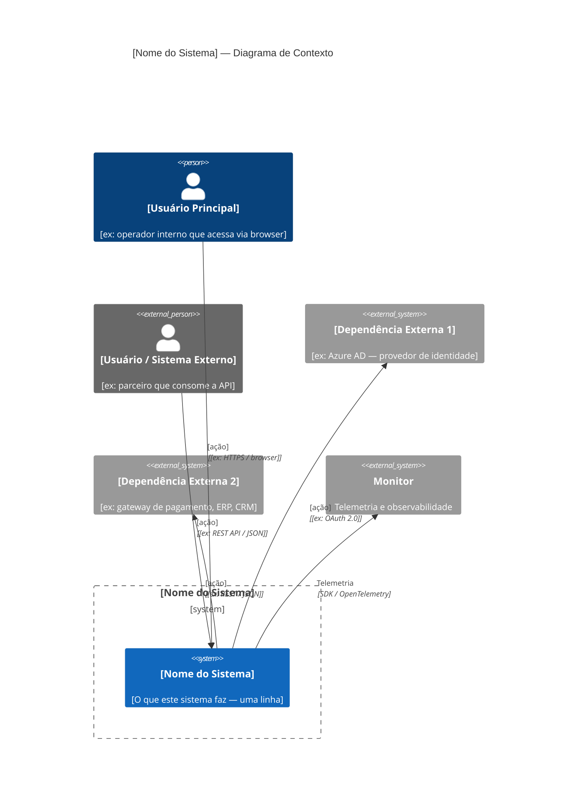
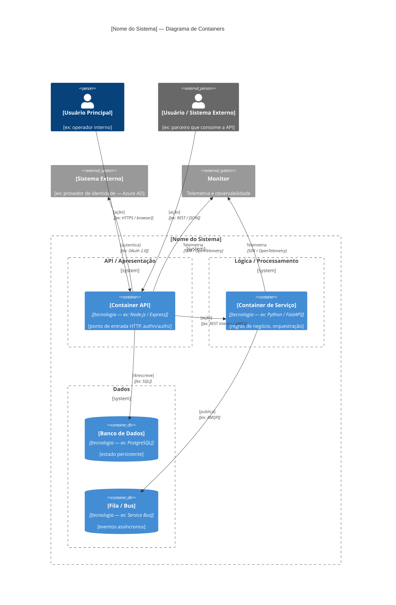

# Architecture — Decisões Arquiteturais

> **Instrução para IA**: Consulte este documento ao gerar o `design.md` de
> qualquer spec. Todo design técnico deve estar alinhado com as decisões
> registradas aqui. Se houver conflito, reporte ao humano antes de prosseguir.

---

## Estilo Arquitetural

<!-- Ex: Microsserviços, Monolito Modular, Event-driven, CQRS, etc. -->

**[PREENCHER]**

---

## Diagrama de Contexto (C4 Level 1)

> **Legenda dos elementos C4:**
>
> | Elemento | Mermaid | O que preencher |
> |---|---|---|
> | Usuário / Persona | `Person` | Quem interage diretamente com o sistema |
> | Usuário externo | `Person_Ext` | Parceiros, integradores, sistemas com usuário humano externo |
> | **Este sistema** | `System` *(dentro do Boundary)* | O sistema que está sendo descrito |
> | Sistema externo | `System_Ext` | Dependências fora do seu controle (IdP, ERP, gateway...) |
> | Relacionamento | `Rel(de, para, "ação", "protocolo")` | O que flui entre os elementos e como |

---

## Diagrama de Containers (C4 Level 2)

> **Legenda dos elementos C4 Level 2:**
>
> | Elemento | Mermaid | O que preencher |
> |---|---|---|
> | Container (app/serviço) | `Container` | Processos executáveis dentro do sistema |
> | Container de dados | `ContainerDb` | Bancos de dados, filas, buckets |
> | Boundary externo | `Boundary(b0, ...)` | Agrupa todos os containers do sistema |
> | Boundary de camada | `Boundary(b1, ...)` aninhado | Agrupa containers por responsabilidade (API, Serviço, Dados) |
> | Sistema externo | `System_Ext` | Igual ao Level 1 |
> | Relacionamento | `Rel(de, para, "ação", "protocolo")` | O que flui e como |
>
> **Dica de layout**: use Boundaries aninhados por camada para deixar os
> relacionamentos mais legíveis — ex: `b-api` → `b-servico` → `b-dados`.

---

## Decisões Arquiteturais (ADRs)

> Este é o **índice** dos ADRs. Cada linha deve ter um link para o arquivo
> detalhado em `.sdd/adr/ADR-xx-titulo.md`.
> Use o template em `.sdd/adr/_template.md` para criar novos ADRs.
> Registre a decisão **no momento em que for tomada**, nunca retroativamente.
>
> **Status possíveis**: `Proposto` · `Aceito` · `Obsoleto` · `Substituído por ADR-xx`

| ID     | Decisão                         | Justificativa resumida          | Status  | Detalhe |
|--------|---------------------------------|---------------------------------|---------|---------|
| ADR-01 | [PREENCHER]                     | [PREENCHER]                     | Aceito  | [ADR-01](../adr/ADR-01-titulo.md) |

---

## Padrões Obrigatórios

> Todo código gerado por IA para este projeto deve seguir estes padrões.

### Comunicação entre serviços
- [PREENCHER — ex: REST/JSON, gRPC, mensageria assíncrona via Service Bus]

### Tratamento de erros
- [PREENCHER — ex: resultado tipado, exceções vs. códigos de erro, circuit breaker]

### Autenticação / Autorização
- [PREENCHER — ex: OAuth 2.0 + Azure AD, API Keys, RBAC]

### Persistência
- [PREENCHER — ex: bancos de dados utilizados, padrão de acesso (Repository, ORM)]

### Observabilidade (ver apm-standards.md para detalhes)

- Toda entrada de sistema deve gerar um trace distribuído
- Toda operação de negócio relevante deve emitir um custom event
- Toda exceção não tratada deve ser capturada e enviada ao APM

---

## Fronteiras de Componentes

<!-- Descreva quais componentes existem e o que cada um é responsável.
     Importante para que a IA não gere código fora dos limites de cada componente. -->

| Componente         | Responsabilidade                  | Não faz                            |
|--------------------|-----------------------------------|------------------------------------|
| [PREENCHER]        | [PREENCHER]                       | [PREENCHER]                        |

---

## Dependências Externas Aprovadas

<!-- Libs, SDKs e serviços externos que são permitidos. A IA não deve introduzir
     novas dependências fora desta lista sem aprovação humana. -->

| Dependência              | Propósito                          | Versão / Tier    |
|--------------------------|------------------------------------|------------------|
| Azure Monitor SDK        | Telemetria APM                     | Última estável   |
| [PREENCHER]              | [PREENCHER]                        | [PREENCHER]      |
