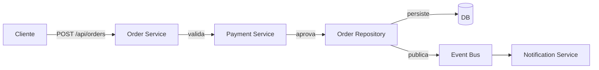
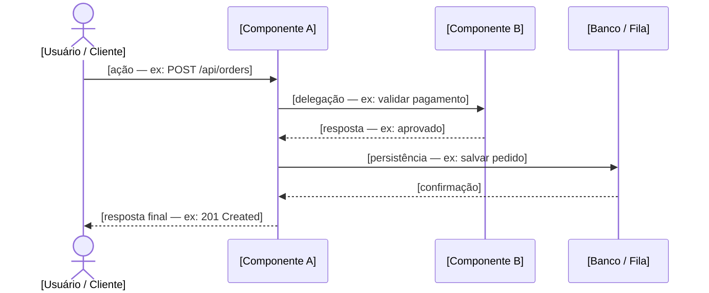
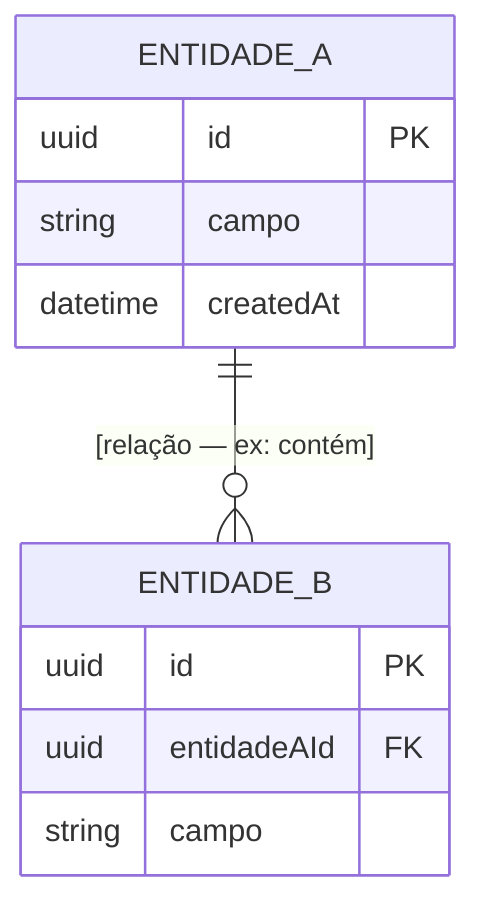
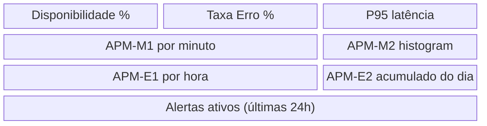

# Design — [Nome da Feature]

> **Pré-condição**: `requirements.md` deve estar aprovado por um humano antes
> de preencher este documento.
>
> **Instrução para IA**: Preencha as seções marcadas com `[IA]` com base em
> `requirements.md`, `architecture.md` e `apm-standards.md`. Reporte qualquer
> conflito com a `constitution.md` antes de prosseguir. Ao finalizar,
> verifique o checklist no final.

---

## Resumo do Design

> Uma ou duas frases descrevendo a abordagem técnica adotada.

**[IA preenche]**

---

## Arquitetura de Componentes `[IA]`

> Descreva os componentes envolvidos e suas responsabilidades nesta feature.
> Deve ser consistente com `architecture.md`.



---

## Fluxo de Dados (Data Flow) `[IA]`

> Descreva o fluxo de dados do ponto de entrada ao ponto de saída, incluindo
> transformações, validações e persistência.

1. **Entrada**: [Como os dados entram no sistema — formato, protocolo]
2. **Validação**: [Quais validações são aplicadas e onde]
3. **Processamento**: [Transformações e lógica de negócio]
4. **Persistência**: [Como e onde os dados são armazenados]
5. **Saída**: [Como a resposta/evento é gerado]

---

## Diagrama de Sequência `[IA]`

> Descreva o fluxo principal da feature entre atores e componentes.
> Use um diagrama por fluxo relevante (happy path obrigatório; fluxos de erro opcionais).



---

## Modelos de Dados `[IA]`

> Descreva as entidades principais desta feature e seus atributos relevantes.
> NÃO é um DDL completo — foque nos campos essenciais para entender o design.
> Se houver relacionamentos entre entidades, represente com ERD abaixo da tabela.

### [Nome da Entidade]

| Campo          | Tipo     | Descrição                              | Obrigatório |
|----------------|----------|----------------------------------------|-------------|
| `id`           | UUID     | Identificador único                    | Sim         |
| `[campo]`      | [tipo]   | [descrição]                            | [Sim/Não]   |
| `createdAt`    | DateTime | Timestamp de criação (UTC)             | Sim         |



---

## Contratos de Interface `[IA]`

> Defina as interfaces expostas por esta feature. Estas devem ser estáveis
> e qualquer mudança requer aprovação humana explícita.

### API REST (se aplicável)

```
[MÉTODO] /api/[recurso]

Request:
{
  "campo": "tipo e descrição"
}

Response 200:
{
  "campo": "tipo e descrição"
}

Response 4xx/5xx:
{
  "error": {
    "code": "CODIGO_ERRO",
    "message": "Descrição legível"
  }
}
```

### Eventos / Mensagens (se aplicável)

```
Tópico/Fila: [nome]
Esquema:
{
  "eventType": "[NomeDoEvento]",
  "eventId": "UUID",
  "occurredAt": "ISO 8601",
  "payload": { ... }
}
```

---

## Tratamento de Erros `[IA]`

| Cenário de Erro                    | Tratamento                            | Código HTTP | Log Level |
|------------------------------------|---------------------------------------|-------------|-----------|
| [PREENCHER — ex: entidade não encontrada] | [ex: retorna 404 com msg amigável] | 404     | WARN      |
| [PREENCHER — ex: timeout externo]  | [ex: retry + circuit breaker]         | 503         | ERROR     |
| [PREENCHER — ex: violação de regra]| [ex: retorna 422 com detalhe]         | 422         | INFO      |

---

## Estratégia de Testes `[IA]`

| Nível de Teste    | O que será testado                              | Abordagem           |
|-------------------|-------------------------------------------------|---------------------|
| Unitário          | Lógica de negócio isolada                       | [PREENCHER]         |
| Integração        | Contratos de interface e persistência           | [PREENCHER]         |
| E2E               | Fluxo completo do ponto de vista do usuário     | [PREENCHER]         |
| Contrato          | Compatibilidade entre produtor/consumidor (API) | [PREENCHER]         |

---

## APM / Observability Design `[IA]`

> **Esta seção é obrigatória** (constitution.md, Princípio 1).
> Para cada item, referencie o requisito de observabilidade correspondente
> de `requirements.md` (ex: `[OBS-1]`).

### Traces Distribuídos

> Quais operações desta feature devem gerar spans rastreáveis?

| Span                              | Operação                              | Req. Observ.  |
|-----------------------------------|---------------------------------------|---------------|
| `[domínio].[operação].start`      | [Descrição da operação rastreada]     | [OBS-x]       |
| `[domínio].[operação].external`   | [Chamada externa rastreada]           | [OBS-x]       |

---

### Métricas Customizadas

> Siga a convenção de nomenclatura de `apm-standards.md`.

| ID      | Nome da Métrica                          | Tipo       | Descrição                          | Req. Observ. |
|---------|------------------------------------------|------------|------------------------------------|--------------|
| APM-M1  | `[domínio].[componente].[operação].count`| Counter    | [O que conta]                      | [OBS-x]      |
| APM-M2  | `[domínio].[componente].[operação].ms`   | Histogram  | [O que mede em ms]                 | [OBS-x]      |
| APM-M3  | `[domínio].[componente].[gauge].current` | Gauge      | [O que representa]                 | [OBS-x]      |

---

### Custom Events (Eventos de Negócio)

> Siga a convenção PascalCase de `apm-standards.md`.

| ID      | Nome do Evento          | Quando emitir                          | Propriedades chave              | Req. Observ. |
|---------|-------------------------|----------------------------------------|---------------------------------|--------------|
| APM-E1  | `[EntidadeVerbo]`       | [Condição de disparo]                  | `{campo: tipo, ...}`            | [OBS-x]      |
| APM-E2  | `[EntidadeVerbo]`       | [Condição de disparo]                  | `{campo: tipo, ...}`            | [OBS-x]      |

---

### SLOs desta Feature

> Especialização dos SLOs padrão de `apm-standards.md` para esta feature.
> Justifique qualquer valor mais restritivo ou mais permissivo que o padrão.

| Indicador              | Meta desta Feature  | Padrão Global  | Justificativa           |
|------------------------|---------------------|----------------|-------------------------|
| Latência P95           | [PREENCHER]         | < 500ms        | [PREENCHER se diferente]|
| Latência P99           | [PREENCHER]         | < 2000ms       | [PREENCHER se diferente]|
| Taxa de Erro           | [PREENCHER]         | < 1%           | [PREENCHER se diferente]|
| Disponibilidade        | [PREENCHER]         | > 99.9%        | [PREENCHER se diferente]|

---

### Alertas

> Use o template de `apm-standards.md`.

```yaml
# ALT-01
alert:
  id: ALT-01
  name: "[Nome do alerta]"
  condition: "[APM-Mx] > [threshold] por [janela de tempo]"
  severity: Critical | High | Medium | Low
  impact: "[Impacto para o usuário/negócio]"
  action: "[O que fazer quando disparar]"
  runbook: "[Referência ou descrição do procedimento]"

# ALT-02
alert:
  id: ALT-02
  name: "[Nome do alerta]"
  condition: "[Condição]"
  severity: [Severidade]
  impact: "[Impacto]"
  action: "[Ação]"
  runbook: "[Referência]"
```

---

### Conceito de Dashboard

> Quais painéis devem existir para esta feature? Descreva visualmente.



---

## Abordagem de Migração / Deploy

> Como esta feature será entregue? Há riscos de compatibilidade retroativa?

- [ ] **Feature flag**: [Sim/Não — descreva se sim]
- [ ] **Migração de dados**: [Sim/Não — descreva se sim]
- [ ] **Rollback plan**: [PREENCHER]

---

## Checklist de Conformidade (IA verifica antes de finalizar)

```
[ ] Alinhado com architecture.md (estilo arquitetural, padrões obrigatórios)
[ ] Alinhado com apm-standards.md (nomenclatura e tipos de telemetria)
[ ] Seção APM/Observability Design completa:
    [ ] Traces definidos
    [ ] Métricas (APM-Mx) com IDs únicos
    [ ] Custom Events (APM-Ex) com IDs únicos
    [ ] SLOs especializados para esta feature
    [ ] Alertas com template completo
    [ ] Conceito de dashboard definido
[ ] Contratos de interface definidos e estáveis
[ ] Tratamento de erros mapeado
[ ] Estratégia de testes definida
[ ] Todos os requisitos OBS-x de requirements.md têm correspondência aqui
```
