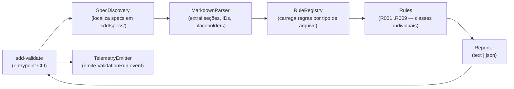
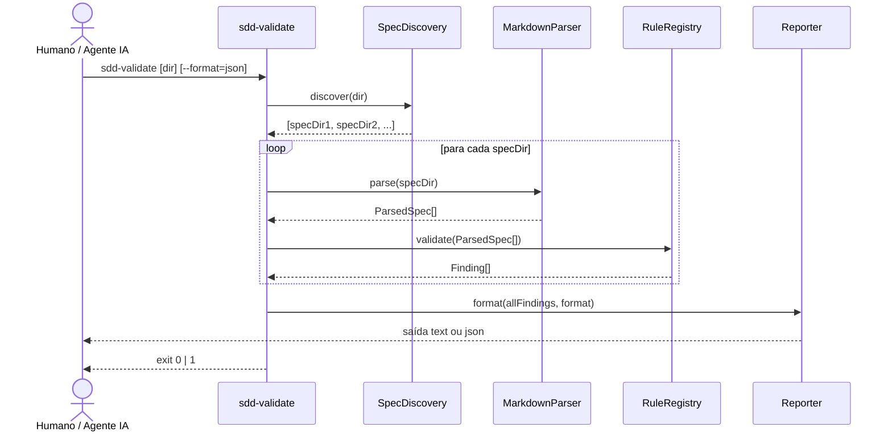
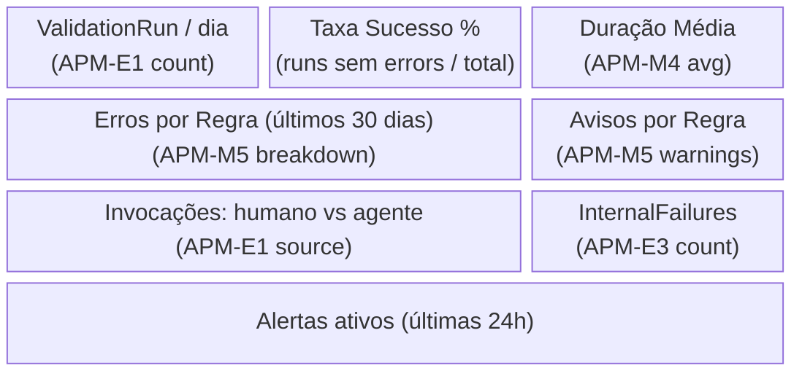

# Design — Harness Sensors (Spec Validation)

> **Pré-condição**: `requirements.md` aprovado.
>
> **Instrução para IA**: Qualquer conflito com `constitution.md` deve ser
> reportado antes de prosseguir.

---

## Resumo do Design

CLI `sdd-validate` com registro plugável de regras. Cada regra recebe o
conteúdo do arquivo e retorna uma lista de achados (erros ou avisos) com
arquivo, linha e sugestão de correção — formato otimizado para consumo por LLM
e por pipelines de CI.

> **Runtime em aberto**: a escolha de linguagem/runtime (Node.js/TypeScript,
> Python, Go, shell) fica para T-IMP-01, que avaliará o ambiente real do projeto
> antes de iniciar a implementação. O design de componentes e contratos abaixo
> é independente dessa escolha.

---

## Arquitetura de Componentes



### Responsabilidades

| Componente        | Responsabilidade                                                               |
|-------------------|--------------------------------------------------------------------------------|
| `CLI`             | Recebe argumentos, orquestra o pipeline, define código de saída                |
| `SpecDiscovery`   | Encontra diretórios de spec válidos em `.sdd/specs/` (excluindo `_template/`)  |
| `MarkdownParser`  | Extrai seções `##`, IDs (`REQ-x.x`, `OBS-x`, `APM-Mx`, `APM-Ex`, `T-xxx`), placeholders `[PREENCHER]` |
| `RuleRegistry`    | Mapeia tipo de arquivo (`requirements`, `design`, `tasks`) às regras aplicáveis |
| `Rules`           | Funções puras — recebem `ParsedSpec` e retornam `Finding[]`                   |
| `Reporter`        | Formata achados em `text` (stdout legível) ou `json` (schema estável)          |
| `TelemetryEmitter`| Emite evento `ValidationRun` estruturado para stdout ou endpoint configurável  |

---

## Fluxo de Dados

1. **Entrada**: argumentos CLI (`target-dir`, `--format`, `--spec`, `--strict`)
2. **Descoberta**: `SpecDiscovery` varre `target-dir/.sdd/specs/**` e lista subdiretórios com pelo menos um arquivo de spec
3. **Parse**: para cada arquivo detectado, `MarkdownParser` gera `ParsedSpec` com seções, IDs extraídos e posições de linha
4. **Validação**: `RuleRegistry` seleciona regras aplicáveis ao tipo de arquivo e executa cada uma; achados acumulados
5. **Telemetria**: `TelemetryEmitter` agrega contagens e duração e emite `ValidationRun`
6. **Saída**: `Reporter` formata o resultado final; código de saída 0 (sem erros) ou 1 (≥1 erro)

---

## Diagrama de Sequência — Fluxo Principal



---

## Modelos de Dados

### ParsedSpec

| Campo          | Tipo              | Descrição                                              |
|----------------|-------------------|--------------------------------------------------------|
| `file`         | `string`          | Caminho relativo do arquivo validado                   |
| `type`         | `SpecFileType`    | `requirements` \| `design` \| `tasks`                 |
| `sections`     | `string[]`        | Títulos `##` encontrados no arquivo                    |
| `ids`          | `SpecId[]`        | IDs extraídos com tipo, valor e número de linha         |
| `placeholders` | `Placeholder[]`   | Ocorrências de `[PREENCHER]` com número de linha       |
| `rawLines`     | `string[]`        | Linhas brutas (para verificações baseadas em padrão)   |

### Finding

| Campo        | Tipo                  | Descrição                                              |
|--------------|-----------------------|--------------------------------------------------------|
| `ruleId`     | `string`              | Identificador da regra (ex: `R001`)                    |
| `severity`   | `'error' \| 'warning'`| Nível — erro bloqueia CI; aviso não bloqueia           |
| `file`       | `string`              | Caminho relativo do arquivo com o problema             |
| `line`       | `number \| undefined` | Número de linha (1-based), quando disponível           |
| `message`    | `string`              | Descrição do problema legível por humano e LLM         |
| `suggestion` | `string \| undefined` | Indicação de como corrigir                             |

### ValidationSummary

| Campo          | Tipo       | Descrição                                 |
|----------------|------------|-------------------------------------------|
| `specsScanned` | `number`   | Total de diretórios de spec processados   |
| `filesScanned` | `number`   | Total de arquivos .md processados         |
| `errors`       | `number`   | Total de achados com severity `error`     |
| `warnings`     | `number`   | Total de achados com severity `warning`   |
| `durationMs`   | `number`   | Tempo total de execução em milissegundos  |

---

## Contratos de Interface

### CLI

```
sdd-validate [target-dir] [options]

Argumentos:
  target-dir          Raiz do repositório a validar (default: CWD)

Opções:
  --format=text|json  Formato de saída (default: text)
  --spec=<tipo>       Validar apenas um tipo: requirements|design|tasks
  --strict            Tratar warnings como errors (para CI mais rigoroso)

Códigos de saída:
  0   Sucesso — nenhum erro encontrado (warnings não afetam)
  1   Pelo menos um erro encontrado (ou warning com --strict)
  2   Erro interno do validador (exceção não tratada)
```

### JSON Output Schema (contrato estável)

```json
{
  "summary": {
    "specsScanned": 2,
    "filesScanned": 5,
    "errors": 1,
    "warnings": 2,
    "durationMs": 312
  },
  "results": [
    {
      "spec": ".sdd/specs/minha-feature",
      "findings": [
        {
          "ruleId": "R007",
          "severity": "error",
          "file": ".sdd/specs/minha-feature/tasks.md",
          "line": 34,
          "message": "Task T-003 não contém referência [REQ-x.x]",
          "suggestion": "Adicione [REQ-x.x] ao título ou descrição da task"
        }
      ]
    }
  ]
}
```

---

## Catálogo de Regras

| ID   | Arquivo alvo      | Severidade | Descrição da regra                                                     | Req.    |
|------|-------------------|------------|------------------------------------------------------------------------|---------|
| R001 | `requirements`    | error      | Pelo menos um item `OBS-x` presente em cada uma das 3 subseções        | REQ-1.1 |
| R002 | `requirements`    | warning    | Nenhuma ocorrência de `[PREENCHER]` no arquivo                         | REQ-1.2 |
| R003 | `requirements`    | error      | IDs `REQ-x.x` são únicos no arquivo                                    | REQ-1.3 |
| R004 | `requirements`    | error      | Ao menos um bloco `REQ-x.x` presente                                   | REQ-1.4 |
| R005 | `design`          | error      | Seção `## Application Performance Monitor` ou `## APM` presente        | REQ-1.5 |
| R006 | `design`          | error      | Cada `OBS-x` do `requirements.md` correspondente tem `APM-Mx` ou `APM-Ex` | REQ-1.6 |
| R007 | `design`          | error      | IDs `APM-Mx` e `APM-Ex` são únicos no arquivo                         | REQ-1.6 |
| R008 | `tasks`           | error      | Tasks `T-APM-01` a `T-APM-05` estão presentes                         | REQ-1.7 |
| R009 | `tasks`           | warning    | Toda task de implementação (não T-APM, não T-DOC) contém `[REQ-x.x]`  | REQ-1.8 |

> Novas regras implementam o contrato `Rule` (pseudocódigo agnóstico de linguagem):
> ```
> Rule {
>   id: string
>   name: string
>   severity: 'error' | 'warning'
>   appliesTo: 'requirements' | 'design' | 'tasks' | 'all'
>   check(spec: ParsedSpec, context: SpecContext) → Finding[]
> }
> ```
> Novas regras são registradas no `RuleRegistry` sem alterar o núcleo — REQ NFR Extensibilidade.

---

## Tratamento de Erros

| Cenário                                          | Tratamento                                                | Código de saída | Nível de log |
|--------------------------------------------------|-----------------------------------------------------------|-----------------|--------------|
| Arquivo de spec não encontrado / ilegível        | Finding com severity `error`, processa demais arquivos    | 1               | WARN         |
| Diretório `.sdd/specs/` não existe               | Aviso informativo, retorna sucesso (sem specs = ok)       | 0               | INFO         |
| Exceção interna em uma regra                     | Isola a regra, adiciona Finding `R000` com mensagem segura| 1               | ERROR        |
| Exceção não tratada no processo principal        | Loga contexto em stderr (sem conteúdo do spec), exit 2    | 2               | ERROR        |
| Argumento CLI inválido                           | Mensagem de uso no stderr, exit 2                         | 2               | — (stderr)   |

---

## Estratégia de Testes

| Nível        | O que será testado                                                    | Abordagem                                         |
|--------------|-----------------------------------------------------------------------|---------------------------------------------------|
| Unitário     | Cada regra (`R001`–`R009`) individualmente                            | Fixtures de spec válidas e inválidas em arquivos `.md` de teste |
| Unitário     | `MarkdownParser` — extração de IDs, seções e placeholders             | Strings de markdown de entrada → estrutura esperada |
| Integração   | Pipeline completo: fixture de spec → JSON de saída esperado           | Golden files para cada combinação de erro/aviso   |
| E2E CLI      | `sdd-validate` chamado como processo com args reais                   | Executa sobre specs de exemplo; verifica exit code e stdout |
| Contrato     | JSON output schema — não quebra entre versões                         | Schema snapshot versionado                        |

---

## Application Performance Monitor / Observability Design

> Esta seção adapta o modelo de APM para um artefato CLI — sem HTTP nem
> serviço persistente. Telemetria é emitida como linha JSON estruturada em
> stdout (separada do relatório) e pode ser capturada por log aggregators.

### Traces Distribuídos

Não aplicável — o validador é um processo síncrono de única thread sem chamadas
externas. Não há spans distribuídos.

---

### Métricas Customizadas

Emitidas como campos do evento `ValidationRun` (ver Custom Events abaixo).
Não requerem um sistema de métricas separado para o CLI.

| ID      | Nome da Métrica                         | Tipo      | Descrição                                      | Req.  |
|---------|-----------------------------------------|-----------|------------------------------------------------|-------|
| APM-M1  | `sdd.validator.specs_scanned.count`     | Counter   | Total de diretórios de spec processados        | OBS-1 |
| APM-M2  | `sdd.validator.errors.count`            | Counter   | Total de erros encontrados na execução         | OBS-1 |
| APM-M3  | `sdd.validator.warnings.count`          | Counter   | Total de avisos encontrados na execução        | OBS-1 |
| APM-M4  | `sdd.validator.duration.ms`             | Histogram | Tempo total de execução em ms                  | OBS-1 |
| APM-M5  | `sdd.validator.errors_by_rule.count`    | Counter   | Erros por `ruleId` — permite análise por categoria | OBS-2 |

---

### Custom Events (Eventos de Negócio)

| ID      | Nome do Evento    | Quando emitir                        | Propriedades chave                                                                     | Req.        |
|---------|-------------------|--------------------------------------|----------------------------------------------------------------------------------------|-------------|
| APM-E1  | `ValidationRun`   | Ao final de cada execução do CLI     | `{ specsScanned, filesScanned, errors, warnings, durationMs, format, strict, source }` | OBS-1, OBS-4 |
| APM-E2  | `ValidationError` | Quando uma regra gera ≥1 erro        | `{ ruleId, specPath, severity, occurrences }`                                          | OBS-2, OBS-3 |
| APM-E3  | `InternalFailure` | Exceção não tratada no processo      | `{ errorCode, component, message }` — **sem conteúdo dos specs**                       | OBS-5       |

> `source`: `"human"` quando chamado diretamente; `"agent"` quando chamado por
> agente de IA (detectado via variável de ambiente `SDD_CALLER=agent`).

---

### SLOs desta Feature

| Indicador           | Meta desta Feature       | Padrão Global | Justificativa                                           |
|---------------------|--------------------------|---------------|---------------------------------------------------------|
| Latência P95        | < 2 000ms por spec       | < 500ms       | CLI local sem I/O de rede — tempo dominado por parse de arquivo |
| Latência P99        | < 5 000ms por execução   | < 2 000ms     | Repositório com muitos specs; ainda local              |
| Taxa de Erro Interno| < 0,5%                   | < 1%          | Ferramenta determinística — exceções internas são bugs  |
| Disponibilidade     | N/A                      | > 99.9%       | CLI local — disponibilidade não se aplica              |

---

### Alertas

> **Status (T-APM-04)**: especificado, **não configurado**. Este repositório
> não tem hoje nenhum backend de observabilidade real (Datadog, Grafana,
> etc.) onde essas queries possam ser registradas ou testadas em staging.
> As duas queries abaixo estão prontas para configuração assim que um
> backend existir — a decisão de deixá-las apenas documentadas (em vez de
> tentar simular/fabricar uma configuração) foi tomada explicitamente para
> este trabalho.

```yaml
# ALT-01
alert:
  id: ALT-01
  name: "sdd-validate Internal Failure Rate Alta"
  condition: "InternalFailure events > 2 em 24h"
  severity: High
  impact: "Validador falhando silenciosamente — specs inválidas podem passar sem detecção"
  action: "Verificar logs do componente reportado em InternalFailure.component"
  runbook: "Ver seção Tratamento de Erros em design.md — cenário 'Exceção interna em uma regra'"

# ALT-02
alert:
  id: ALT-02
  name: "Taxa de Erros R008 Alta (T-APM ausentes)"
  condition: "ValidationError{ruleId='R008'} > 5 em 7 dias"
  severity: Medium
  impact: "Times criando tasks.md sem incluir T-APM obrigatórias — erosão do princípio de observabilidade"
  action: "Revisar guides e checklists do SDD; reforçar regra no AGENTS.md se necessário"
  runbook: "Atualizar sdd-workflow SKILL.md com exemplo explícito de T-APM-01..05"
```

---

### Conceito de Dashboard

> **Status (T-APM-05)**: especificado, **não construído**. Sem backend de
> observabilidade real, não há onde publicar este dashboard nem URL para
> compartilhar/registrar em `KNOWLEDGE.md`. O conceito abaixo já mapeia cada
> painel ao evento/métrica exato que o alimentaria (APM-E1, APM-M4, APM-M5,
> APM-E3), pronto para implementação quando um backend estiver disponível.



---

## Abordagem de Deploy

- [x] **Feature flag**: Não — a ferramenta é um binário/script novo; sem risco de retrocompatibilidade
- [x] **Migração de dados**: Não aplicável
- [x] **Rollback plan**: Remover o binário/script do PATH / desfazer step no CI; specs continuam funcionando sem o validador
- [ ] **Empacotamento**: a ser definido em T-IMP-01 junto com a escolha de runtime

---

## Checklist de Conformidade

```
[x] Alinhado com architecture.md — architecture.md ainda é template; sem conflitos detectados
[x] Runtime em aberto — decisão delegada para T-IMP-01 (ver nota em Resumo do Design)
[x] Alinhado com apm-standards.md — nomenclatura sdd.validator.* segue convenção <domínio>.<componente>.<operação>
[x] Seção APM / Observability Design completa:
    [x] Traces definidos (N/A justificado para CLI síncrono)
    [x] Métricas (APM-M1..M5) com IDs únicos
    [x] Custom Events (APM-E1..E3) com IDs únicos
    [x] SLOs especializados para esta feature
    [x] Alertas com template completo (ALT-01, ALT-02)
    [x] Conceito de dashboard definido
[x] Contratos de interface definidos — CLI args + JSON schema
[x] Tratamento de erros mapeado (5 cenários)
[x] Estratégia de testes definida (5 níveis)
[x] Todos os OBS-x de requirements.md têm correspondência:
    OBS-1 → APM-M1..M4 + APM-E1
    OBS-2 → APM-M5 + APM-E2
    OBS-3 → APM-E2 (trend via log aggregation)
    OBS-4 → APM-E1.source
    OBS-5 → APM-E3 + Tratamento de Erros (exit 2)
```
