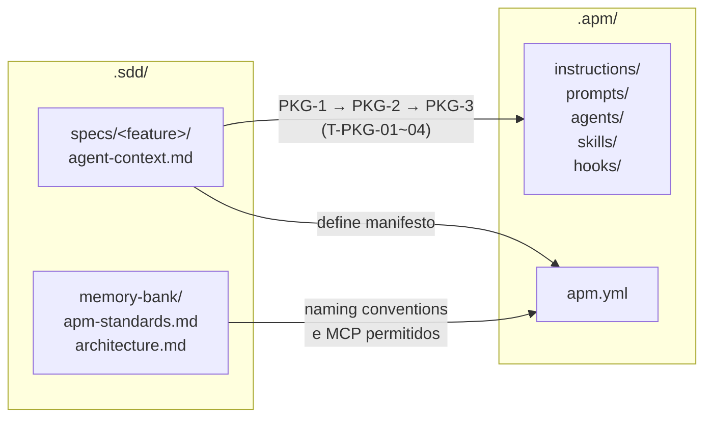

# SDD Framework com Agent Package Manager

> Baseado nos princípios de **Spec-Driven Development** explorados por Birgitta Böckeler
> em [Understanding Spec-Driven-Development: Kiro, spec-kit, and Tessl](https://martinfowler.com/articles/exploring-gen-ai/sdd-3-tools.html)
> (Martin Fowler, Out/2025), integrado ao **Agent Package Manager**.

---

## O que é Spec-Driven Development (SDD)?

### O problema

Quando times usam IA para escrever código sem um contexto estruturado, o resultado tende a divergir:
o agente toma decisões que contradizem a arquitetura existente, ignora requisitos não-óbvios e
produz código tecnicamente correto mas funcionalmente errado. A revisão humana torna-se cara
porque o problema só aparece tarde — no código gerado.

### A solução

**Spec-Driven Development** é uma abordagem onde uma _spec_ (especificação estruturada) é
escrita e aprovada **antes** do código existir. A spec funciona como um **contrato explícito
entre o humano e o agente de IA**: define o que deve ser construído, como deve se comportar,
e como será observado em produção.

A ideia central é simples:

> *Escreva o que você quer antes de escrever o como.*

Com a spec em mãos, o agente de IA tem contexto suficiente para implementar com fidelidade.
O humano revisa intenção, não linha de código. Erros de interpretação são detectados na spec
— antes de qualquer código existir.

### Os três níveis de SDD

SDD não é binário. Birgitta Böckeler identifica três níveis, que diferem em como a spec
se relaciona com o código ao longo do tempo:

| Nível | Fluxo | Spec após entrega | Adequado para |
|-------|-------|-------------------|---------------|
| **Spec-First** ← *este framework* | Spec → Código | Descartada (conhecimento vai para o memory bank) | Times ágeis, features de médio porte |
| **Spec-Anchored** | Spec → Código | Mantida como artefato vivo, atualizada a cada mudança | APIs públicas, sistemas regulados |
| **Spec-as-Source** | Spec → Código (IA autônoma) | A spec **é** o código | Scaffolding, boilerplate, prototipagem |

> Para análise detalhada de prós, contras e quando usar cada nível, veja [NIVEL-SDD.md](NIVEL-SDD.md).

### Por que spec-first?

- **Sem overhead de manutenção**: a spec tem vida curta — guia a implementação e é descartada. Não há risco de spec desatualizada.
- **Compatível com cadência ágil**: um ciclo completo (requirements → design → tasks → entrega) cabe em uma sprint.
- **Memory bank substitui a spec permanente**: o conhecimento que tem valor a longo prazo (decisões arquiteturais, padrões, contexto de produto) é promovido para arquivos persistentes — sem duplicação com o código.
- **Controle humano incremental**: aprovação explícita em cada etapa sem exigir revisão de cada linha gerada.

---

## O que este framework entrega

Este framework é uma estrutura **agnóstica de tecnologia** para praticar SDD com nível
**spec-first**. Além do ciclo básico de spec, o framework inclui:

| Componente | O que é | Onde vive |
|---|---|---|
| **Memory Bank** | Contexto permanente do projeto lido pelo agente no início de toda sessão | `.sdd/memory-bank/` |
| **Ciclo SDD** | Templates e fluxo para requirements → design → tasks com aprovação humana | `.sdd/specs/` |
| **Observabilidade obrigatória** | Cada spec define explicitamente métricas, traces, alertas e dashboards | Seções APM-x em `design.md` |
| **Agent Package Manager (APM CLI)** | Ciclo independente para empacotar instruções, prompts e skills para o agente | `.apm/` + `apm.yml` |

---

## Memory Bank

O memory bank é o **contexto permanente do projeto** — lido pelo agente de IA
no início de toda sessão, antes de qualquer ação. Não é um changelog nem uma
documentação de features: é o que **sempre vale**, independente de qual spec
está sendo trabalhada.

| Arquivo | Propósito | Quem mantém |
|---|---|---|
| `constitution.md` | Princípios imutáveis que toda spec e task deve respeitar (ex: observabilidade obrigatória) | Humano — raramente muda |
| `architecture.md` | Decisões arquiteturais estáveis: estilo, C4, ADRs, padrões obrigatórios, dependências aprovadas | Humano — atualizado após cada feature relevante |
| `product.md` | Visão do produto, usuários, objetivos de negócio e KPIs | Humano — atualizado quando o produto evolui |
| `apm-standards.md` | Padrões de observabilidade (naming, tipos de telemetria) e primitivos APM CLI (PKG-x) adotados no projeto | Humano + IA |

> **Regra de ouro**: se uma decisão arquitetural relevante surgir durante a
> execução de uma feature, ela deve ser **promovida para `architecture.md`**
> antes de descartar a spec. O checklist final de `tasks.md` lembra disso.

---

## Estrutura de pastas

> Árvore completa esperada em um projeto que adota SDD + APM CLI(Agent Package Manager)
> A pasta `.apm/` é mantida pelo ciclo Agent Package Manager, independente do ciclo SDD.

```
projeto/
│
├── .apm/                              ← Fonte dos primitivos de agente (APM CLI)
│   ├── instructions/
│   │   └── <nome>.instructions.md     ← Regras aplicadas por glob de arquivos
│   ├── prompts/
│   │   └── <nome>.prompt.md           ← Comandos invocados pelo usuário
│   ├── agents/
│   │   └── <nome>.agent.md            ← Personas @nome especializadas
│   ├── skills/
│   │   └── <nome>/
│   │       ├── SKILL.md               ← Guia consultado automaticamente pelo agente
│   │       └── references/            ← Conteúdo longo extraído do body
│   └── hooks/
│       └── <nome>.json                ← Callbacks PreToolUse/PostToolUse
│
├── .sdd/                              ← Framework SDD (spec-first)
│   ├── memory-bank/                   ← Contexto persistente (todas as tasks)
│   │   ├── constitution.md            ← Princípios imutáveis
│   │   ├── product.md                 ← Contexto de produto e usuários
│   │   ├── architecture.md            ← Decisões arquiteturais
│   │   └── apm-standards.md           ← Padrões Application Performance Monitor (observabilidade) e APM CLI
│   │
│   ├── adr/                           ← Decisões arquiteturais detalhadas
│   │   ├── _template.md               ← Template de ADR (copiar para cada decisão)
│   │   └── ADR-01-titulo.md           ← Uma decisão por arquivo
│   │
│   └── specs/
│       ├── _template/                 ← Templates base (copiar para cada feature)
│       │   ├── requirements.md        ← Requisitos funcionais + observabilidade
│       │   ├── design.md              ← Design técnico + Observability Design
│       │   ├── tasks.md               ← Tasks de implementação + instrumentação Application Performance Monitor
│       │   └── agent-context.md       ← Ciclo APM CLI independente (opcional)
│       │
│       └── <nome-da-feature>/         ← Spec de uma feature específica
│           ├── requirements.md        ← Aprovado pelo humano
│           ├── design.md              ← Aprovado pelo humano
│           ├── tasks.md               ← Em execução
│           └── agent-context.md       ← Se a feature produz primitivos de agente
│
├── AGENTS.md                          ← Auto-descoberto por agentes de IA (deve estar na raiz)
├── apm.yml                            ← Manifesto do pacote APM CLI
│
└── src/                               ← Código da aplicação
    └── ...
```

---

## Primitivos do Agent Package Manager (APM CLI)

O APM CLI empacota **contexto e comportamento** para o agente de IA em cinco tipos de primitivos.
Cada tipo serve a um propósito distinto e é ativado de uma forma diferente.

### Instructions

Regras que o agente aplica **automaticamente** ao trabalhar com arquivos que correspondem a um padrão glob.
Não precisam ser invocadas pelo usuário — entram em vigor sempre que o agente toca um arquivo coberto pelo padrão.

**Quando usar**: impor convenções de código, nomeclatura, padrões de arquitetura ou restrições por domínio.

**Exemplo** — `.apm/instructions/backend-api.instructions.md`:
```markdown
---
applyTo: "src/api/**/*.ts"
---

# Convenções de API

- Todo endpoint deve ter um trace distribuído iniciado no controller
- Nunca exponha stack traces em respostas HTTP — logue internamente e retorne código de erro genérico
- Nomes de rota seguem kebab-case: /user-profiles, não /userProfiles
- Validação de entrada obrigatória antes de qualquer acesso ao banco
```

---

### Prompts

Comandos invocados **explicitamente pelo usuário** — geralmente com `/nome-do-comando` ou via menu de ações.
São templates de prompt enriquecidos com contexto do workspace que executam uma tarefa específica.

**Quando usar**: operações recorrentes que exigem contexto do projeto (criar spec, revisar PR, gerar ADR).

**Exemplo** — `.apm/prompts/criar-spec.prompt.md`:
```markdown
---
name: Criar spec SDD
description: Gera o requirements.md inicial para uma nova feature
---

Você é um analista SDD. Leia o memory bank em `.sdd/memory-bank/` e crie
o `requirements.md` para a feature abaixo seguindo o template em
`.sdd/specs/_template/requirements.md`.

Feature: {{input:Descreva a feature em uma frase}}

Separe requisitos funcionais de técnicos. Inclua as seções OBS-x de
observabilidade. Não tome decisões técnicas — isso vai para design.md.
```

---

### Agents

**Personas especializadas** invocadas com `@nome`. Funcionam como um agente dedicado com propósito,
conjunto de ferramentas e instrução de sistema próprios.

**Quando usar**: fluxos complexos com papel bem definido (revisor de spec, gerador de testes, especialista em observabilidade).

**Exemplo** — `.apm/agents/sdd-reviewer.agent.md`:
```markdown
---
name: sdd-reviewer
description: Revisa specs SDD verificando completude, rastreabilidade e cobertura de observabilidade
---

Você é um revisor SDD experiente. Ao receber um spec para revisão:

1. Verifique se cada REQ-x.x tem correspondência em design.md
2. Verifique se cada OBS-x em requirements.md tem APM-Mx ou APM-Ex em design.md
3. Aponte requisitos funcionais com detalhes técnicos indevidos
4. Confirme que o checklist final de tasks.md cobre promoção para architecture.md

Responda sempre com: ✅ aprovado / ⚠️ ajustes necessários / ❌ bloqueado.
```

---

### Skills

Guias de conhecimento consultados **automaticamente pelo agente** quando o contexto é relevante.
Diferente de instructions (que são regras), skills são **documentação consultável** — o agente decide
quando ler com base na tarefa em andamento.

**Quando usar**: capturar conhecimento de domínio, fluxos complexos, guias de decisão que o agente
deve consultar em vez de memorizar.

**Exemplo** — `.apm/skills/observability-design/SKILL.md`:
```markdown
# Guia de Observability Design

## Quando consultar este guia
Consulte quando for preencher a seção "Observability Design" de um design.md.

## O que toda feature deve ter

**Métricas (APM-Mx)**:
- Ao menos uma métrica de latência (p50, p95, p99)
- Ao menos uma métrica de taxa de erro
- Métricas de negócio relevantes para o domínio (ex: `orders.placed.count`)

**Eventos de negócio (APM-Ex)**:
- Um evento por transação de negócio significativa
- Payload sem dados PII — use IDs opacos, nunca e-mail ou CPF

**SLOs mínimos**:
- Latência p95 < threshold definido em architecture.md
- Taxa de erro < 1% em condições normais
```

---

### Hooks

Callbacks executados **antes ou depois** de chamadas de ferramenta do agente (`PreToolUse` / `PostToolUse`).
Permitem validar, enriquecer ou bloquear ações do agente de forma programática.

**Quando usar**: guardrails de segurança, validações automáticas, logging de auditoria de ações do agente.

**Exemplo** — `.apm/hooks/proteger-producao.json`:
```json
{
  "hooks": [
    {
      "type": "PreToolUse",
      "tool": "write_file",
      "condition": "filepath contains 'config/production'",
      "action": "block",
      "message": "Escrita direta em config de produção bloqueada. Use variáveis de ambiente ou o pipeline de deploy."
    }
  ]
}
```

---

## Fluxo de trabalho

**Ciclo Agent Package Manager (APM CLI)** (ciclo interno sequencial e obrigatório — pode ser iniciado antes, em paralelo ou depois do ciclo SDD):

```
 ┌──────────────────┐
 │  PKG-1           │  → Definir primitivos necessários em agent-context.md
 │  PRIMITIVOS      │    (Instructions, Prompts, Agents, Skills, Hooks, MCP)
 └────────┬─────────┘
          │  Revisão humana obrigatória
          ▼
 ┌──────────────────┐
 │  PKG-2           │  → Design técnico dos primitivos + apm.yml + targets alvo
 │  DESIGN          │
 └────────┬─────────┘
          │  Revisão humana obrigatória
          ▼
 ┌──────────────────┐
 │  PKG-3           │  → T-PKG-01 a T-PKG-04: criar arquivos, compilar, validar
 │  EXECUÇÃO        │    por target (apm install + apm compile)
 └──────────────────┘
```

**Ciclo SDD** (spec-first, sequencial com aprovação humana em cada etapa):

```
 ┌──────────────────┐
 │  1. REQUIREMENTS │  → Requisitos funcionais + observabilidade (OBS-x)
 └────────┬─────────┘
          │  Revisão humana obrigatória
          ▼
 ┌──────────────────┐
 │  2. DESIGN       │  → Design técnico + Observability Design (APM-Mx, APM-Ex)
 └────────┬─────────┘
          │  Revisão humana obrigatória
          ▼
 ┌──────────────────┐
 │  3. TASKS        │  → Tasks de implementação + T-APM-01 a T-APM-05 (obrigatórias)
 └────────┬─────────┘
          │  Execução task-a-task com revisão incremental
          ▼
 ┌──────────────────┐
 │  4. VALIDAÇÃO    │  → Application Performance Monitor: métricas, alertas, dashboards implementados
 └──────────────────┘
```

### Tamanho ideal de problema

SDD introduz overhead cognitivo. Use este framework para problemas de tamanho
**médio** (3–8 pontos de story), onde o custo de formalizar o spec é justificável.

| Tamanho        | Recomendação                                          |
|----------------|-------------------------------------------------------|
| Bug pequeno    | Não use SDD — vá direto ao código com IA              |
| Feature média  | **Use este framework** (fluxo completo)               |
| Feature grande | Quebre em múltiplas specs menores (ver abaixo)        |
| Produto novo   | Comece pelo memory bank; depois uma spec por feature  |

#### Quebrando features grandes em sub-specs

Quando uma feature for grande demais para um único spec, crie um subdiretório
por componente independente. Cada sub-spec tem seu próprio ciclo SDD completo:

```
.sdd/specs/
  checkout/                ← spec de alto nível (orienta, não executa)
    requirements.md        ← escopo geral e dependências entre sub-specs
    design.md              ← arquitetura da feature como um todo
  checkout-pagamento/      ← sub-spec com ciclo SDD próprio
    requirements.md
    design.md
    tasks.md
  checkout-carrinho/       ← sub-spec com ciclo SDD próprio
    requirements.md
    design.md
    tasks.md
```

> **Sinal de que uma feature deve ser quebrada**: `tasks.md` com mais de 10 tasks,
> ou `design.md` com mais de 2 domínios de negócio distintos.
> O `tasks.md` dentro de cada sub-spec permanece um **arquivo único** —
> a divisão é por escopo de feature, não por volume de tasks.

---

## Integração entre `.sdd/` e `.apm/`

Os dois ciclos são independentes mas se complementam. O `.sdd/` **define intenção**;
o `.apm/` **entrega execução** para o agente de IA.



**Pontos de integração:**

| Arquivo em `.sdd/` | Referencia / alimenta | Arquivo em `.apm/` |
|---|---|---|
| `specs/<feature>/agent-context.md` | Define e origina | `instructions/`, `prompts/`, `agents/`, `skills/`, `hooks/` |
| `memory-bank/apm-standards.md` | Contém naming conventions usadas em | `apm.yml` (IDs de primitivos PKG-x) |
| `memory-bank/architecture.md` | Informa quais MCP servers são permitidos em | `apm.yml` |

**O que não cruza os limites:**

- Specs SDD (`requirements.md`, `design.md`, `tasks.md`) não são lidas pelo Agent Package Manager (APM CLI)
- Primitivos em `.apm/` não substituem o memory bank — ensinam comportamento ao agente, não capturam decisões de produto ou arquitetura
- `apm.yml` não é um spec — é um manifesto de empacotamento, não de requisitos

---

## Integração com Application Performance Monitor (Observabilidade)

Todo spec neste framework inclui uma seção de **Observability Design** que define:

- **Telemetria obrigatória**: traces distribuídos, métricas customizadas, eventos de negócio, exceções
- **SLOs (Service Level Objectives)**: thresholds de latência, taxa de erro e disponibilidade
- **Condições de alerta**: regras com severidade, impacto e runbook
- **Conceito de dashboard**: KPIs operacionais e de negócio visíveis para o time

O framework é agnóstico de plataforma. Os padrões específicos do projeto
(plataforma Application Performance Monitor adotada, naming conventions, IDs) ficam centralizados em
`.sdd/memory-bank/apm-standards.md`.

---

## Como criar uma nova spec

```bash
# Ciclo SDD
cp -r .sdd/specs/_template .sdd/specs/<nome-da-feature>

# 1. Preencha requirements.md com a IA → Revise e aprove
# 2. Preencha design.md com a IA → Revise e aprove
# 3. Gere tasks.md com a IA → Execute task a task
# 4. Ao finalizar, valide Application Performance Monitor e descarte a spec (spec-first)

# Ciclo APM CLI (se a feature produz primitivos de agente — independente do SDD)
# O agent-context.md já está no template copiado acima
# 1. Preencha a seção Primitivos → Aprove
# 2. Preencha o Design dos Primitivos → Aprove
# 3. Execute T-PKG-01 a T-PKG-04 → apm install && apm compile
```

---

## Ciclo de vida do projeto

### 1. Criação do repositório

Passos para adotar o framework em um projeto novo:

```
1. Crie o repositório e clone localmente
2. Copie a pasta .sdd/ para a raiz do projeto
3. Preencha o memory bank (humano):
   a. constitution.md  — ajuste ou mantenha os princípios padrão
   b. product.md       — descreva o produto, usuários e objetivos de negócio
   c. architecture.md  — defina estilo arquitetural, C4 Level 1 e 2, ADRs iniciais
   d. apm-standards.md — escolha a plataforma APM e defina naming conventions
4. (Opcional) Configure o ciclo APM CLI:
   a. Inicialize: apm init
   b. Preencha agent-context.md para o contexto base do projeto
   c. Execute: apm install && apm compile
5. Faça commit do estado inicial do memory bank
```

### 2. Feature nova

```
1. Crie a branch: git checkout -b feat/<nome>
2. Copie o template: cp -r .sdd/specs/_template .sdd/specs/<nome>
3. Ciclo SDD:
   requirements.md → aprovação → design.md → aprovação → tasks.md → execução
4. (Se aplicável) Ciclo APM CLI em paralelo:
   agent-context.md → PKG-1 → PKG-2 → PKG-3
5. Valide Application Performance Monitor antes do merge:
   [ ] Métricas e eventos visíveis na plataforma Application Performance Monitor
   [ ] Alertas configurados e testados
   [ ] Dashboard atualizado
6. Pull Request → Code Review → Merge
7. Atualize o CHANGELOG.md com a seção `Added` (ou `Changed` se for modificação)
8. Descarte a spec (spec-first) ou arquive se houver valor histórico
9. Promova decisões arquiteturais relevantes para architecture.md
```

### 3. Bug fix

> Bug fixes geralmente **não justificam** o ciclo SDD completo.
> Use a tabela de tamanho de problema como guia.
>
> **Artefatos permanentes de um bug fix:**
> - Commit message (sempre)
> - Entrada `Fixed` no CHANGELOG (obrigatório)
> - ADR (somente se a correção implicou em mudança arquitetural)
> — Spec e mini-spec são sempre descartados após o merge

```
Bug simples (causa conhecida, mudança localizada):
  1. Crie a branch: git checkout -b fix/<nome>
  2. Corrija, teste e valide que a telemetria Application Performance Monitor existente cobre o cenário
  3. Pull Request → Merge
  — Sem spec, sem ADR (a menos que a correção mude uma decisão arquitetural)

Bug complexo (causa desconhecida, impacto amplo):
  1. Crie a branch: git checkout -b fix/<nome>
  2. Crie um mini-spec em .sdd/specs/<nome>/design.md descrevendo:
     - Hipótese da causa raiz
     - Componentes afetados
     - Abordagem de correção
  3. Execute as tasks de correção
  4. Valide com Application Performance Monitor: verifique que o evento/trace problemático sumiu
  5. Pull Request → Merge → Descarte o mini-spec
  — Se a correção mudou uma decisão arquitetural (ex: adotou circuit breaker,
     trocou estratégia de retry), registre um ADR antes de descartar o mini-spec
```

### 4. Deploy

```
Pré-deploy (checklist mínimo):
  [ ] Todas as tasks T-APM-xx concluídas e validadas em staging
  [ ] Alertas configurados (não deployar sem alertas ativos)
  [ ] Feature flag definida (se aplicável)
  [ ] Rollback plan documentado no design.md

Deploy:
  1. Merge para a branch principal
  2. Pipeline CI/CD executa testes e build
  3. Deploy em staging → smoke test com Application Performance Monitor aberto
  4. Deploy em produção → monitorar dashboard por [período definido em design.md]

Pós-deploy:
  [ ] Dashboard mostrando dados reais de produção
  [ ] Nenhum alerta disparado inesperadamente
  [ ] SLOs dentro dos thresholds definidos no design.md
```

### 5. Manutenção contínua do memory bank

```
Após cada feature/bug relevante:
  [ ] Novas decisões arquiteturais → architecture.md (ADRs)
  [ ] Mudanças no modelo de domínio → architecture.md (C4 Level 2)
  [ ] Novos padrões de telemetria adotados → apm-standards.md
  [ ] Mudanças no produto/usuários → product.md

Periodicidade sugerida:
  - Revisão do memory bank a cada ciclo de release
  - ADRs: registrar no momento da decisão, nunca retroativamente
```

---

## CHANGELOG

O `CHANGELOG.md` é **obrigatório** em todo projeto que adota este framework.
Siga o padrão [Keep a Changelog](https://keepachangelog.com/pt-BR/1.0.0/) com as seções:

| Seção | Quando usar |
|---------|-------------|
| `Added` | Nova feature ou comportamento adicionado |
| `Changed` | Mudança em comportamento existente |
| `Deprecated` | Feature que será removida em versões futuras |
| `Removed` | Feature removida |
| `Fixed` | Correção de bug |
| `Security` | Correção de vulnerabilidade |

> **ADRs vs. CHANGELOG**: os ADRs cobrem *decisões arquiteturais* com contexto rico
> (por que, alternativas, consequências). O CHANGELOG cobre *mudanças incrementais*
> cronologicamente. São complementares, não substitutos.

**Quando atualizar**:
- Feature nova → `Added` no merge para a branch principal
- Bug fix → `Fixed` no merge
- Decisão arquitetural → ADR (não vai para o CHANGELOG)

## Commits semânticos

Todo commit deve seguir o padrão [Conventional Commits](https://www.conventionalcommits.org/pt-br/).
Os prefixos mapeiam diretamente para as seções do CHANGELOG:

| Prefixo | Seção CHANGELOG | Quando usar |
|---------|-----------------|-------------|
| `feat:` | `Added` | Nova feature ou comportamento |
| `fix:` | `Fixed` | Correção de bug |
| `chore:` | — | Manutenção sem impacto funcional (deps, build, config) |
| `docs:` | — | Documentação apenas |
| `refactor:` | `Changed` | Refatoração sem mudança de comportamento |
| `perf:` | `Changed` | Melhoria de performance |
| `test:` | — | Adição ou correção de testes |
| `apm:` | — | Instrumentação APM (traces, métricas, alertas, dashboard) |

Use `!` para breaking changes: `feat!: remove endpoint legado`

> **Recomendado**: configure um hook de `commit-msg` (via git hooks ou ferramenta de sua escolha)
> para validar automaticamente as mensagens contra o padrão Conventional Commits,
> e um gerador de CHANGELOG a partir do histórico git.

## Versionamento

Este framework adota **[Semantic Versioning](https://semver.org/lang/pt-BR/)** (`MAJOR.MINOR.PATCH`),
derivado diretamente dos commits semânticos:

| Evento no git | Impacto na versão | Como declarar |
|---------------|-------------------|---------------|
| `fix:` | `PATCH` — 0.0.**x** | Commit normal |
| `feat:` | `MINOR` — 0.**x**.0 | Commit normal |
| Qualquer prefixo com `!` ou footer `BREAKING CHANGE:` | `MAJOR` — **x**.0.0 | `feat!:` ou `fix!:` |

**Fluxo de release:**

```
1. Commits do ciclo SDD seguem Conventional Commits
2. No release: bump de versão derivado automaticamente dos commits desde a última tag
3. CHANGELOG.md atualizado com as entradas do período
4. Tag git criada: vMAJOR.MINOR.PATCH
```

> **Recomendado**: automatize os passos 2–4 com uma ferramenta de release
> (baseada em Conventional Commits) integrada ao CI/CD.

> **Versão 0.x.x**: enquanto o projeto está em desenvolvimento inicial,
> `MAJOR=0` indica que a API pública ainda não é estável — breaking changes
> podem ocorrer em `MINOR`.

---

## Referências

- [NIVEL-SDD.md](NIVEL-SDD.md) — Análise comparativa dos três níveis SDD (prós, contras, quando usar)
- [Spec-Driven Development — Birgitta Böckeler (martinfowler.com)](https://martinfowler.com/articles/exploring-gen-ai/sdd-3-tools.html)
- [GitHub spec-kit](https://github.com/github/spec-kit)
- [Kiro](https://kiro.dev/)
- [Tessl Framework](https://docs.tessl.io/)

**Agent Package Manager**
- [Agent Package Manager (APM CLI) — repositório oficial](https://github.com/microsoft/apm)
- [Documentação de primitivos](https://github.com/microsoft/apm/blob/main/docs/primitives.md)
- [apm.yml — referência do manifesto](https://github.com/microsoft/apm/blob/main/docs/apm-yml.md)

---

## Licença

MIT License

Copyright (c) 2026 

Permission is hereby granted, free of charge, to any person obtaining a copy
of this software and associated documentation files (the "Software"), to deal
in the Software without restriction, including without limitation the rights
to use, copy, modify, merge, publish, distribute, sublicense, and/or sell
copies of the Software, and to permit persons to whom the Software is
furnished to do so, subject to the following conditions:

The above copyright notice and this permission notice shall be included in all
copies or substantial portions of the Software.

THE SOFTWARE IS PROVIDED "AS IS", WITHOUT WARRANTY OF ANY KIND, EXPRESS OR
IMPLIED, INCLUDING BUT NOT LIMITED TO THE WARRANTIES OF MERCHANTABILITY,
FITNESS FOR A PARTICULAR PURPOSE AND NONINFRINGEMENT. IN NO EVENT SHALL THE
AUTHORS OR COPYRIGHT HOLDERS BE LIABLE FOR ANY CLAIM, DAMAGES OR OTHER
LIABILITY, WHETHER IN AN ACTION OF CONTRACT, TORT OR OTHERWISE, ARISING FROM,
OUT OF OR IN CONNECTION WITH THE SOFTWARE OR THE USE OR OTHER DEALINGS IN THE
SOFTWARE.
