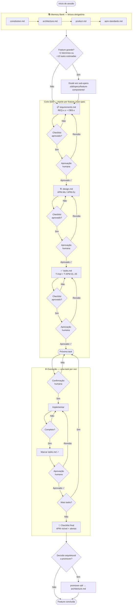
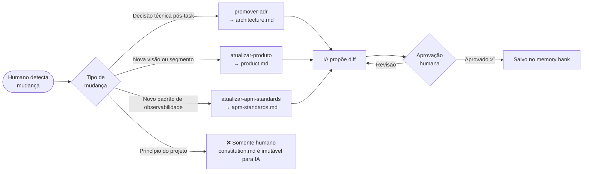
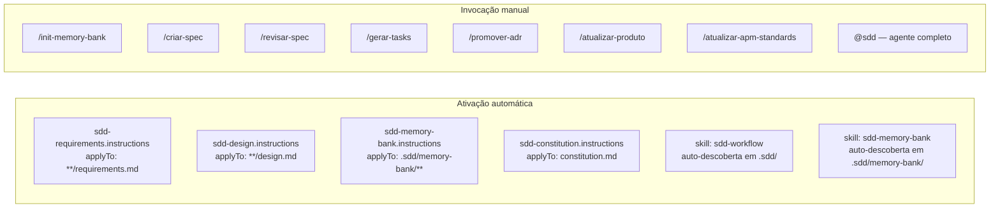

# SDD Flow

Fluxo completo do ciclo Spec-Driven Development, do início de uma sessão até a conclusão de uma feature.

---

## Visão Geral



---

## Memory Bank — Comandos de atualização



---

## Primitivos APM disponíveis



---

## Rastreabilidade

Cada artefato produzido no ciclo mantém rastreabilidade vertical:

```
OBS-x  (requirements.md)
  └── APM-Mx / APM-Ex  (design.md)
        └── T-APM-01..05  (tasks.md)
              └── telemetria instrumentada no código

REQ-x.x  (requirements.md)
  └── decisão de design  (design.md)
        └── T-x  (tasks.md)  [REQ-x.x]
              └── código implementado
```
