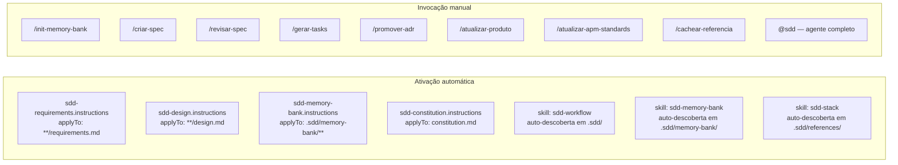

# SDD Flow

Fluxo completo do ciclo Spec-Driven Development, do início de uma sessão até a conclusão de uma feature.

---

## Como usar este framework

Após instalar o pacote (`apm install sdd-framework`), os primitivos são ativados
automaticamente no seu editor. Basta conversar com o agente normalmente.

### Exemplo de sessão — projeto novo

> **Usuário:** quero começar a usar o SDD neste projeto. é uma API de gestão de frotas para logística B2B.
>
> **Agente:** Vou inicializar o memory bank. Antes de criar os arquivos, preciso de algumas informações:
> - Qual o estilo arquitetural? (ex: microsserviços, monolito modular)
> - Quais linguagens/plataformas principais?
> - Já tem dependências externas conhecidas? (banco, broker, gateway)
>
> **Usuário:** microsserviços em Node.js, PostgreSQL e Kafka. gateway de pagamento externo.
>
> **Agente:** *(cria `.sdd/memory-bank/` com os 4 arquivos)* Memory bank inicializado.
> Use `/criar-spec` para começar o primeiro spec.

### Exemplo de sessão — feature nova

> **Usuário:** `/criar-spec rastreamento-de-entrega`
>
> **Agente:** *(lê o memory bank)* Vou criar o `requirements.md` para rastreamento-de-entrega.
> Antes, a pasta `.sdd/specs/rastreamento-de-entrega/` não existe ainda — execute:
> ```
> cp -r .sdd/specs/_template .sdd/specs/rastreamento-de-entrega
> ```
> *(após execução)* Criando `requirements.md`...
>
> **Usuário:** *(revisa o arquivo gerado)* aprovado.
>
> **Agente:** Perfeito. Próximo passo: posso criar o `design.md` quando quiser.
> Use `/revisar-spec requirements` a qualquer momento para uma revisão formal.

### Exemplo de sessão — execução de task

> **Usuário:** pode começar a T-03 do rastreamento-de-entrega?
>
> **Agente:** Confirmando: T-03 — Implementar endpoint `GET /entregas/{id}/posicao` `[REQ-2.1]`.
> Posso iniciar?
>
> **Usuário:** sim
>
> **Agente:** *(implementa)* Concluído. Marquei `[x]` em `tasks.md`. Aguardo sua aprovação
> para avançar para a T-04.

### Primitivos disponíveis

| Como invocar | O que faz |
|---|---|
| `/init-memory-bank` | Inicializa o memory bank em projetos novos |
| `/criar-spec <feature>` | Cria `requirements.md` para uma nova feature |
| `/revisar-spec <etapa>` | Revisa requirements, design ou tasks — retorna ✅/⚠️/❌ |
| `/gerar-tasks <feature>` | Gera `tasks.md` a partir de um `design.md` aprovado |
| `/promover-adr <decisão>` | Registra decisão arquitetural como ADR |
| `/atualizar-produto <mudança>` | Atualiza `product.md` com nova visão ou segmento |
| `/atualizar-apm-standards <padrão>` | Atualiza `apm-standards.md` com novo padrão de observabilidade |
| `/cachear-referencia <url> <tech>` | Busca e cacheia documentação de tecnologia em `.sdd/references/` |
| `@sdd` | Agente completo que conduz o ciclo SDD com aprovações humanas |

---

## Visão Geral

```mermaid
flowchart TD
    SESSION([Início de sessão]) --> MB_EXISTS{"Memory bank<br/>existe?"}
    MB_EXISTS -->|Não| INIT["/init-memory-bank"]
    INIT --> MB
    MB_EXISTS -->|Sim| MB

    subgraph MB["📚 Memory Bank — leitura obrigatória"]
        MB1[constitution.md] --> MB2[architecture.md] --> MB3[product.md] --> MB4[apm-standards.md]
    end

    MB --> SIZE{"Feature grande?<br/>+2 domínios ou<br/>+10 tasks estimadas"}

    SIZE -->|Sim| SPLIT["Dividir em sub-specs<br/>.sdd/specs/feature-componente/"]
    SIZE -->|Não| REQ

    SPLIT --> REQ

    subgraph CYCLE["Ciclo SDD — repete por feature / sub-spec"]
        REQ["📋 requirements.md<br/>REQ-x.x + OBS-x"]
        REQ --> REQ_CK{"Checklist<br/>aprovado?"}
        REQ_CK -->|Não| REQ
        REQ_CK -->|Sim| REQ_AP{"Aprovação<br/>humana"}
        REQ_AP -->|Revisão| REQ
        REQ_AP -->|Aprovado ✅| DES

        DES["🏗️ design.md<br/>APM-Mx / APM-Ex"]
        DES --> DES_CK{"Checklist<br/>aprovado?"}
        DES_CK -->|Não| DES
        DES_CK -->|Sim| DES_AP{"Aprovação<br/>humana"}
        DES_AP -->|Revisão| DES
        DES_AP -->|Aprovado ✅| TASKS

        TASKS["✅ tasks.md<br/>T-impl + T-APM-01..05"]
        TASKS --> TASKS_CK{"Checklist<br/>aprovado?"}
        TASKS_CK -->|Não| TASKS
        TASKS_CK -->|Sim| TASKS_AP{"Aprovação<br/>humana"}
        TASKS_AP -->|Revisão| TASKS
        TASKS_AP -->|Aprovado ✅| T_START
    end

    subgraph EXEC["⚙️ Execução — uma task por vez"]
        T_START([Próxima task]) --> T_CONFIRM{"Confirmação<br/>humana"}
        T_CONFIRM -->|Não| T_START
        T_CONFIRM -->|Sim| T_IMPL[Implementar]
        T_IMPL --> T_DONE{"Completo?"}
        T_DONE -->|Não| T_IMPL
        T_DONE -->|Sim| T_MARK["Marcar tasks.md ✓"]
        T_MARK --> T_AP{"Aprovação<br/>humana"}
        T_AP -->|Revisão| T_IMPL
        T_AP -->|Aprovado ✅| T_MORE{"Mais tasks?"}
        T_MORE -->|Sim| T_START
        T_MORE -->|Não| FINAL
    end

    FINAL["🏁 Checklist final<br/>APM visível + alertas"]
    FINAL --> ADR{"Decisão arquitetural<br/>a promover?"}
    ADR -->|Sim| PROMOTE["promover-adr → architecture.md"]
    ADR -->|Não| DONE([Feature concluída])
    PROMOTE --> DONE
```



---

## Memory Bank — Comandos de atualização


---

## Primitivos APM disponíveis



---

## Rastreabilidade

Cada artefato produzido no ciclo mantém rastreabilidade vertical:

```
OBS-x  (requirements.md)
  └── APM-Mx / APM-Ex  (design.md)
        └── T-APM-01..05  (tasks.md)
              └── telemetria instrumentada no código

REQ-x.x  (requirements.md)
  └── decisão de design  (design.md)
        └── T-x  (tasks.md)  [REQ-x.x]
              └── código implementado
```
