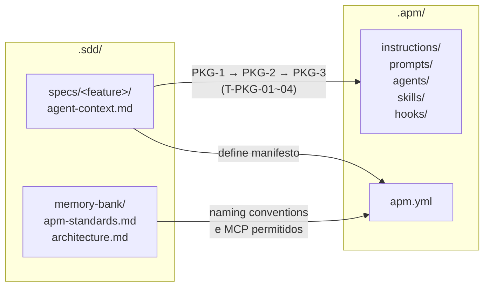

# Agent Package Manager (APM CLI)

> O Agent Package Manager (APM CLI) é um **ciclo independente do SDD** —
> empacota contexto e comportamento para o agente de IA. Pode ser iniciado
> antes, em paralelo ou depois do ciclo SDD, dependendo da maturidade da
> feature. Para o ciclo SDD, veja [README.md](../README.md).

---

## Primitivos do Agent Package Manager (APM CLI)

O APM CLI empacota **contexto e comportamento** para o agente de IA em cinco tipos de primitivos.
Cada tipo serve a um propósito distinto e é ativado de uma forma diferente.

### Instructions

Regras que o agente aplica **automaticamente** ao trabalhar com arquivos que correspondem a um padrão glob.
Não precisam ser invocadas pelo usuário — entram em vigor sempre que o agente toca um arquivo coberto pelo padrão.

**Quando usar**: impor convenções de código, nomeclatura, padrões de arquitetura ou restrições por domínio.

**Exemplo** — `.apm/instructions/backend-api.instructions.md`:
```markdown
---
applyTo: "src/api/**/*.ts"
---

# Convenções de API

- Todo endpoint deve ter um trace distribuído iniciado no controller
- Nunca exponha stack traces em respostas HTTP — logue internamente e retorne código de erro genérico
- Nomes de rota seguem kebab-case: /user-profiles, não /userProfiles
- Validação de entrada obrigatória antes de qualquer acesso ao banco
```

---

### Prompts

Comandos invocados **explicitamente pelo usuário** — geralmente com `/nome-do-comando` ou via menu de ações.
São templates de prompt enriquecidos com contexto do workspace que executam uma tarefa específica.

**Quando usar**: operações recorrentes que exigem contexto do projeto (criar spec, revisar PR, gerar ADR).

**Exemplo** — `.apm/prompts/criar-spec.prompt.md`:
```markdown
---
name: Criar spec SDD
description: Gera o requirements.md inicial para uma nova feature
---

Você é um analista SDD. Leia o memory bank em `.sdd/memory-bank/` e crie
o `requirements.md` para a feature abaixo seguindo o template em
`.sdd/specs/_template/requirements.md`.

Feature: {{input:Descreva a feature em uma frase}}

Separe requisitos funcionais de técnicos. Inclua as seções OBS-x de
observabilidade. Não tome decisões técnicas — isso vai para design.md.
```

---

### Agents

**Personas especializadas** invocadas com `@nome`. Funcionam como um agente dedicado com propósito,
conjunto de ferramentas e instrução de sistema próprios.

**Quando usar**: fluxos complexos com papel bem definido (revisor de spec, gerador de testes, especialista em observabilidade).

**Exemplo** — `.apm/agents/sdd-reviewer.agent.md`:
```markdown
---
name: sdd-reviewer
description: Revisa specs SDD verificando completude, rastreabilidade e cobertura de observabilidade
---

Você é um revisor SDD experiente. Ao receber um spec para revisão:

1. Verifique se cada REQ-x.x tem correspondência em design.md
2. Verifique se cada OBS-x em requirements.md tem APM-Mx ou APM-Ex em design.md
3. Aponte requisitos funcionais com detalhes técnicos indevidos
4. Confirme que o checklist final de tasks.md cobre promoção para architecture.md

Responda sempre com: ✅ aprovado / ⚠️ ajustes necessários / ❌ bloqueado.
```

---

### Skills

Guias de conhecimento consultados **automaticamente pelo agente** quando o contexto é relevante.
Diferente de instructions (que são regras), skills são **documentação consultável** — o agente decide
quando ler com base na tarefa em andamento.

**Quando usar**: capturar conhecimento de domínio, fluxos complexos, guias de decisão que o agente
deve consultar em vez de memorizar.

**Exemplo** — `.apm/skills/observability-design/SKILL.md`:
```markdown
# Guia de Observability Design

## Quando consultar este guia
Consulte quando for preencher a seção "Observability Design" de um design.md.

## O que toda feature deve ter

**Métricas (APM-Mx)**:
- Ao menos uma métrica de latência (p50, p95, p99)
- Ao menos uma métrica de taxa de erro
- Métricas de negócio relevantes para o domínio (ex: `orders.placed.count`)

**Eventos de negócio (APM-Ex)**:
- Um evento por transação de negócio significativa
- Payload sem dados PII — use IDs opacos, nunca e-mail ou CPF

**SLOs mínimos**:
- Latência p95 < threshold definido em architecture.md
- Taxa de erro < 1% em condições normais
```

---

### Hooks

Callbacks executados **antes ou depois** de chamadas de ferramenta do agente (`PreToolUse` / `PostToolUse`).
Permitem validar, enriquecer ou bloquear ações do agente de forma programática.

**Quando usar**: guardrails de segurança, validações automáticas, logging de auditoria de ações do agente.

**Exemplo** — `.apm/hooks/proteger-producao.json`:
```json
{
  "hooks": [
    {
      "type": "PreToolUse",
      "tool": "write_file",
      "condition": "filepath contains 'config/production'",
      "action": "block",
      "message": "Escrita direta em config de produção bloqueada. Use variáveis de ambiente ou o pipeline de deploy."
    }
  ]
}
```

---

## Fluxo de trabalho (ciclo APM CLI)

Ciclo interno sequencial e obrigatório — pode ser iniciado antes, em paralelo
ou depois do ciclo SDD:

```
 ┌──────────────────┐
 │  PKG-1           │  → Definir primitivos necessários em agent-context.md
 │  PRIMITIVOS      │    (Instructions, Prompts, Agents, Skills, Hooks, MCP)
 └────────┬─────────┘
          │  Revisão humana obrigatória
          ▼
 ┌──────────────────┐
 │  PKG-2           │  → Design técnico dos primitivos + apm.yml + targets alvo
 │  DESIGN          │
 └────────┬─────────┘
          │  Revisão humana obrigatória
          ▼
 ┌──────────────────┐
 │  PKG-3           │  → T-PKG-01 a T-PKG-04: criar arquivos, compilar, validar
 │  EXECUÇÃO        │    por target (apm install + apm compile)
 └──────────────────┘
```

Fluxo operacional que o agente segue: [AGENTS.md](../AGENTS.md) → Workflow
Agent Package Manager (APM CLI).

---

## Integração entre `.sdd/` e `.apm/`

Os dois ciclos são independentes mas se complementam. O `.sdd/` **define intenção**;
o `.apm/` **entrega execução** para o agente de IA.



**Pontos de integração:**

| Arquivo em `.sdd/` | Referencia / alimenta | Arquivo em `.apm/` |
|---|---|---|
| `specs/<feature>/agent-context.md` | Define e origina | `instructions/`, `prompts/`, `agents/`, `skills/`, `hooks/` |
| `memory-bank/apm-standards.md` | Contém naming conventions usadas em | `apm.yml` (IDs de primitivos PKG-x) |
| `memory-bank/architecture.md` | Informa quais MCP servers são permitidos em | `apm.yml` |

**O que não cruza os limites:**

- Specs SDD (`requirements.md`, `design.md`, `tasks.md`) não são lidas pelo Agent Package Manager (APM CLI)
- Primitivos em `.apm/` não substituem o memory bank — ensinam comportamento ao agente, não capturam decisões de produto ou arquitetura
- `apm.yml` não é um spec — é um manifesto de empacotamento, não de requisitos
