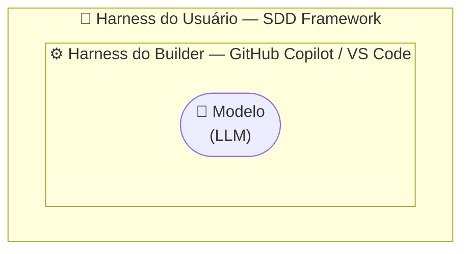
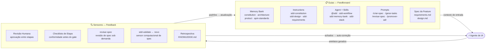
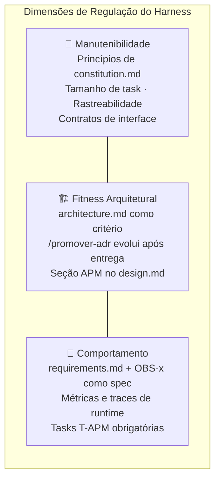
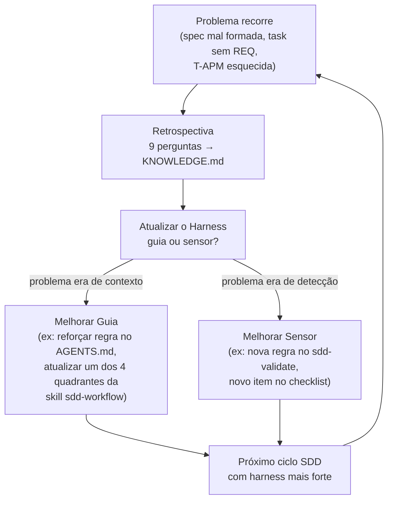
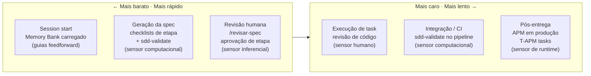

# Harness Flow — SDD como Harness de Agente de IA

> Baseado em [Harness Engineering for Coding Agent Users](https://martinfowler.com/articles/harness-engineering.html)
> de Birgitta Böckeler (ThoughtWorks, Abr/2026).

---

## O que é um Harness?

**Harness** é tudo que envolve um agente de IA além do próprio modelo. Funciona
em camadas:



O **SDD Framework é o harness do usuário**: o que o seu time constrói e mantém
para que o agente produza resultados confiáveis neste projeto específico.

---

## Guias e Sensores

Um harness eficaz combina dois tipos de controle:

| Tipo | Direção | Propósito | Execução |
|------|---------|-----------|----------|
| **Guia** | Feedforward (antes) | Aumentar a probabilidade de acerto na primeira tentativa | Inferencial ou Computacional |
| **Sensor** | Feedback (depois) | Detectar problemas e permitir auto-correção | Inferencial ou Computacional |



---

## Mapa SDD × Harness Engineering

### Guias (Feedforward) — todos Inferenciais

| Artefato SDD | Papel no Harness |
|---|---|
| `AGENTS.md` | Guia de convenção principal — carregado a cada sessão |
| `constitution.md` | Guia de restrição imutável — princípios que nunca mudam |
| `architecture.md` | Guia de fitness arquitetural — restringe decisões de design |
| `product.md` + `apm-standards.md` | Guias de contexto — ancora escopo e convenções APM |
| `sdd-*.instructions.md` | Guias por escopo de arquivo — regras aplicadas automaticamente por glob |
| `sdd.agent.md` | Bundle de guias em uma persona — workflow pré-carregado |
| Skills (`sdd-workflow`, `sdd-memory-bank`, `sdd-stack`) | Guias how-to ativados preguiçosamente no contexto |
| Prompts (`/criar-spec`, `/gerar-tasks`, ...) | Padrões de invocação estruturados — scaffolding do workflow |
| `requirements.md` + `design.md` por spec | Contexto feedforward específico da feature |

### Sensores (Feedback)

| Artefato SDD | Tipo | Papel no Harness |
|---|---|---|
| Aprovação humana (req → design → tasks) | Inferencial | Sensor primário — humano como juiz em cada etapa |
| `revisar-spec.prompt.md` | Inferencial | Revisão de qualidade de spec — IA como juiz, sob demanda |
| Checklists de etapa | Inferencial (leve) | Verificação de completude antes de cada gate |
| Retrospectiva → `KNOWLEDGE.md` | Inferencial | Loop de melhoria do harness após cada ciclo |
| Req. de observabilidade (`OBS-x` → `APM-Mx/Ex`) | Inferencial | Especifica sensores de runtime para o produto |
| `sdd-validate` *(em construção)* | **Computacional** | Valida estrutura de specs automaticamente |
| T-APM-01..05 (tasks obrigatórias) | Computacional (no produto) | Implementa os sensores de runtime no código entregue |

---

## Dimensões de Regulação



| Dimensão | Cobertura no SDD | Maturidade |
|---|---|---|
| **Manutenibilidade** | `constitution.md`, revisão humana por task, checklists | ✅ Estabelecida |
| **Fitness Arquitetural** | `architecture.md`, ADRs, seção APM obrigatória no design | ✅ Estabelecida |
| **Comportamento** | `requirements.md` como spec feedforward; sensores de runtime via T-APM | ⚠️ Em maturação |

---

## O Loop de Direção (Steering Loop)

> Não confundir com o **LOOP** da skill `sdd-workflow` (`.apm/skills/sdd-workflow/references/loop.md`)
> — este Steering Loop é retrospectiva **humana** entre ciclos SDD; aquele
> é o ciclo interno ação→observação→ajuste do agente, dentro de uma única
> task, com limite de 3 tentativas. Dois mecanismos diferentes, mesma
> palavra "loop" — decisão de nomenclatura registrada em `KNOWLEDGE.md`.

O humano **direciona** o harness iterando sobre ele sempre que um problema
recorre. Cada ciclo SDD melhora os guias e sensores para o próximo:



---

## Timing — Mantendo a Qualidade à Esquerda

O princípio *shift-left* se aplica ao ciclo SDD: quanto mais cedo um problema
é detectado, mais barato é corrigi-lo.



---

## Harnessability do SDD

Nem todo projeto é igualmente harnessável. O SDD Framework melhora a
harnessability de qualquer repositório via:

| Affordance Ambiente | Como SDD provê |
|---|---|
| **Legibilidade** | Memory bank estruturado — agente sempre sabe o contexto do projeto |
| **Navegabilidade** | Specs em `.sdd/specs/<feature>/` com estrutura previsível |
| **Tratabilidade** | Checklists e gates humanos que impedem avanço com spec incompleta |
| **Detectabilidade** | `sdd-validate` como sensor computacional (em construção) |

---

## Lacuna Atual e Próximo Passo

O SDD Framework é **majoritariamente feedforward e inferencial** — forte em guias,
ainda limitado em sensores computacionais. Isso é esperado para um *harness de spec*,
mas a lacuna é reconhecida:

```
Guias (feedforward) ████████████████████ forte
Sensores inferenciais ████████████░░░░░░░░ moderado (manual/sob demanda)
Sensores computacionais ████░░░░░░░░░░░░░░░░ em construção → sdd-validate
```

O spec [harness-sensors](../.sdd/specs/harness-sensors/tasks.md) endereça essa lacuna
adicionando o primeiro sensor computacional do framework.

---

## Referências

- [Harness Engineering for Coding Agent Users](https://martinfowler.com/articles/harness-engineering.html) — Birgitta Böckeler, Abr/2026
- [SDD-FLOW.md](SDD-FLOW.md) — Diagramas do ciclo SDD completo
- [NIVEL-SDD.md](NIVEL-SDD.md) — Análise comparativa dos três níveis de SDD
- [.sdd/specs/harness-sensors/](../.sdd/specs/harness-sensors/tasks.md) — Spec de implementação do `sdd-validate`
