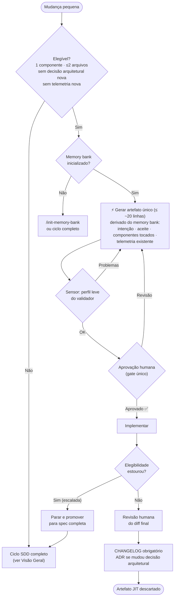
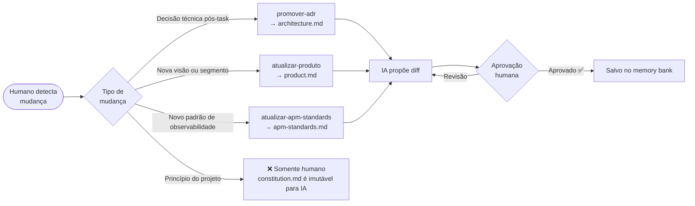
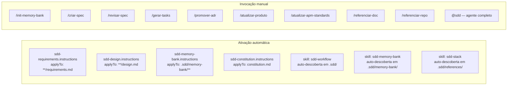

# SDD Flow — Referência de Diagramas

Diagramas de referência do ciclo Spec-Driven Development.

> Para exemplos de sessão e guia de uso, veja [SDD-SESSION.md](SDD-SESSION.md).

---

## Visão Geral

```mermaid
flowchart TD
    SESSION([Início de sessão]) --> MB_EXISTS{"Memory bank<br/>existe?"}
    MB_EXISTS -->|Não| INIT["/init-memory-bank"]
    INIT --> MB
    MB_EXISTS -->|Sim| MB

    subgraph MB["📚 Memory Bank — leitura obrigatória"]
        MB1[constitution.md] --> MB2[architecture.md] --> MB3[product.md] --> MB4[apm-standards.md]
    end

    MB --> TRIAGE{"Tamanho do<br/>problema?"}

    TRIAGE -->|"Trivial<br/>(typo, cosmético)"| DIRECT([Direto ao código<br/>sem spec])
    TRIAGE -->|"Pequeno<br/>(1 componente, ≤2 arquivos)"| JIT["⚡ Fluxo JIT Spec<br/>(ver diagrama abaixo)"]
    TRIAGE -->|"Médio ou maior"| SIZE{"Feature grande?<br/>+2 domínios ou<br/>+10 tasks estimadas"}

    SIZE -->|Sim| SPLIT["Dividir em sub-specs<br/>.sdd/specs/feature-componente/"]
    SIZE -->|Não| REQ

    SPLIT --> REQ

    subgraph CYCLE["Ciclo SDD — repete por feature / sub-spec"]
        REQ["📋 requirements.md<br/>REQ-x.x + OBS-x"]
        REQ --> REQ_CK{"Checklist<br/>aprovado?"}
        REQ_CK -->|Não| REQ
        REQ_CK -->|Sim| REQ_AP{"Aprovação<br/>humana"}
        REQ_AP -->|Revisão| REQ
        REQ_AP -->|Aprovado ✅| DES

        DES["🏗️ design.md<br/>APM-Mx / APM-Ex"]
        DES --> DES_CK{"Checklist<br/>aprovado?"}
        DES_CK -->|Não| DES
        DES_CK -->|Sim| DES_AP{"Aprovação<br/>humana"}
        DES_AP -->|Revisão| DES
        DES_AP -->|Aprovado ✅| TASKS

        TASKS["✅ tasks.md<br/>T-impl + T-APM-01..05 + T-DOC-01..03"]
        TASKS --> TASKS_CK{"Checklist<br/>aprovado?"}
        TASKS_CK -->|Não| TASKS
        TASKS_CK -->|Sim| TASKS_AP{"Aprovação<br/>humana"}
        TASKS_AP -->|Revisão| TASKS
        TASKS_AP -->|Aprovado ✅| T_START
    end

    subgraph EXEC["⚙️ Execução — uma task por vez"]
        T_START([Próxima task]) --> T_CONFIRM{"Confirmação<br/>humana"}
        T_CONFIRM -->|Não| T_START
        T_CONFIRM -->|Sim| T_IMPL[Implementar]
        T_IMPL --> T_DONE{"Completo?"}
        T_DONE -->|Não| T_IMPL
        T_DONE -->|Sim| T_MARK["Marcar tasks.md ✓"]
        T_MARK --> T_AP{"Aprovação<br/>humana"}
        T_AP -->|Revisão| T_IMPL
        T_AP -->|Aprovado ✅| T_MORE{"Mais tasks?"}
        T_MORE -->|Sim| T_START
        T_MORE -->|Não| FINAL
    end

    FINAL["🏁 Checklist final<br/>APM + T-DOC concluídas"]
    FINAL --> RETRO{"Retrospectiva<br/>do ciclo?
(opcional)"}
    RETRO -->|Sim| RUN_RETRO["Diálogo guiado — 9 perguntas<br/>→ KNOWLEDGE.md"]
    RETRO -->|Não| DONE([Feature concluída])
    RUN_RETRO --> DONE
```



---

## Fluxo JIT Spec — mudanças pequenas

> Alternativa ao ciclo SDD completo (Visão Geral acima) — não uma etapa
> dele. Documentação conceitual completa: [JIT.md](JIT.md). Especificação
> formal deste fluxo (enquanto ativa): `.sdd/specs/jit-spec/`.

Contrato efêmero de artefato único, derivado do memory bank, com um único
gate humano.



> O artefato JIT **não contém** IDs REQ-x, tabelas GIVEN/WHEN/THEN, seções
> OBS-x nem checklists — anti-formalismo é requisito. Se o formato do ciclo
> completo aparecer no artefato, o fluxo degenerou em "SDD em miniatura".

---

## Memory Bank — Comandos de atualização



---

## Primitivos APM disponíveis



---

## Rastreabilidade

Cada artefato produzido no ciclo mantém rastreabilidade vertical:

```
OBS-x  (requirements.md)
  └── APM-Mx / APM-Ex  (design.md)
        └── T-APM-01..05  (tasks.md)
              └── telemetria instrumentada no código

REQ-x.x  (requirements.md)
  └── decisão de design  (design.md)
        └── T-x  (tasks.md)  [REQ-x.x]
              └── código implementado

decisões arquiteturais + padrões emergentes
  └── T-DOC-01..03  (tasks.md)
        └── Memory Bank atualizado
              ├── architecture.md
              ├── KNOWLEDGE.md
              └── product.md
```
