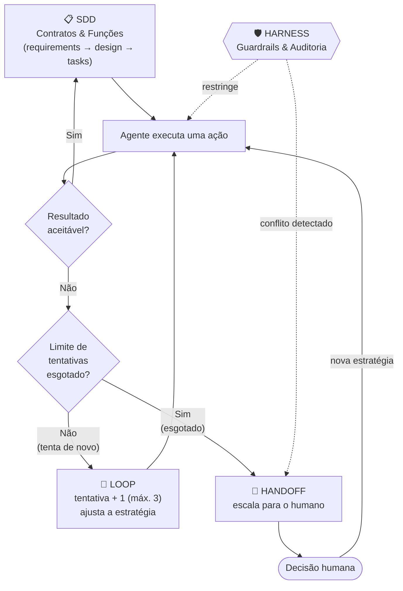

# Arquitetura da Skill — 4 Quadrantes

> Visão geral de como a capacidade de um agente de IA neste framework se
> organiza em 4 partes complementares. Este documento apresenta o modelo;
> cada quadrante tem seu próprio doc com o detalhe completo.

```
 ┌─────────────────────────────────────────────┐
 │                   S K I L L                  │
 │        (Pacote de Capacidade do Agente)      │
 └────────────────────────┬─────────────────────┘
                           │
        ┌──────────────┬──┴───────────┬──────────────┐
        ▼              ▼              ▼              ▼
 ┌────────────┐ ┌────────────┐ ┌────────────┐ ┌────────────┐
 │    SDD     │ │  HARNESS   │ │    LOOP    │ │  HANDOFF   │
 │ Contratos  │ │ Guardrails │ │   Auto-    │ │ Delegação  │
 │ & Funções  │ │& Auditoria │ │ correção   │ │& Escalação │
 └────────────┘ └────────────┘ └────────────┘ └────────────┘
```

---

## SDD — Contratos & Funções

O ciclo `requirements.md` → `design.md` → `tasks.md`, com aprovação humana
entre cada etapa, e a alternativa leve (JIT Spec) para mudanças pequenas.
É o quadrante mais maduro — a maior parte do framework vive aqui.

Detalhe completo: [SDD-FLOW.md](SDD-FLOW.md) (ciclo completo) e
[JIT.md](JIT.md) (alternativa leve).

## HARNESS — Guardrails & Auditoria

O que restringe e observa o comportamento do agente: princípios imutáveis,
comportamentos proibidos, e a distinção entre orientação seguida por
disciplina (o que existe hoje) e guardrails de verdade — enforced por
código, não só texto (ainda não implementado).

Detalhe completo: [HARNESS-FLOW.md](HARNESS-FLOW.md).

## LOOP — Auto-correção

O ciclo interno ação → observação → ajuste pelo qual o agente resolve um
problema sem precisar acertar de primeira, com limite determinístico de
tentativas antes de escalar.

Detalhe completo: [LOOP.md](LOOP.md).

## HANDOFF — Delegação & Escalação

A transferência explícita de controle quando um limite é atingido ou uma
especialização diferente é necessária. Hoje só o handoff para o humano é
aplicável — handoff entre agentes exigiria múltiplas personas, que este
framework ainda não tem.

Detalhe completo: [HANDOFF.md](HANDOFF.md).

---

## Como os quadrantes se relacionam



- **SDD** é o que o agente produz; **HARNESS** é o que restringe como ele
  produz — por isso aparece como restrição pontilhada, não como um passo
  do fluxo principal.
- **LOOP** é o que acontece quando uma ação dentro do SDD (ou de qualquer
  outro trabalho) não dá certo de primeira — ele tenta de novo, com limite.
- **HANDOFF** é para onde o LOOP vai quando esgota o limite, ou quando o
  próprio HARNESS aponta um conflito que exige decisão humana.

Nenhum quadrante substitui os outros — SDD sem LOOP seria frágil a
qualquer erro transitório; LOOP sem HANDOFF viraria insistência sem fim;
HARNESS sem HANDOFF não teria para onde escalar uma violação.
